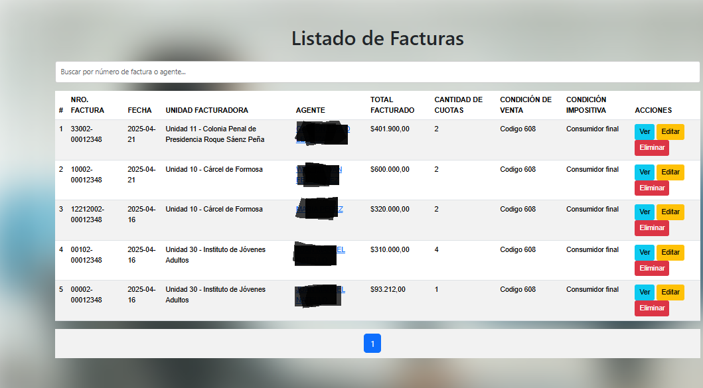
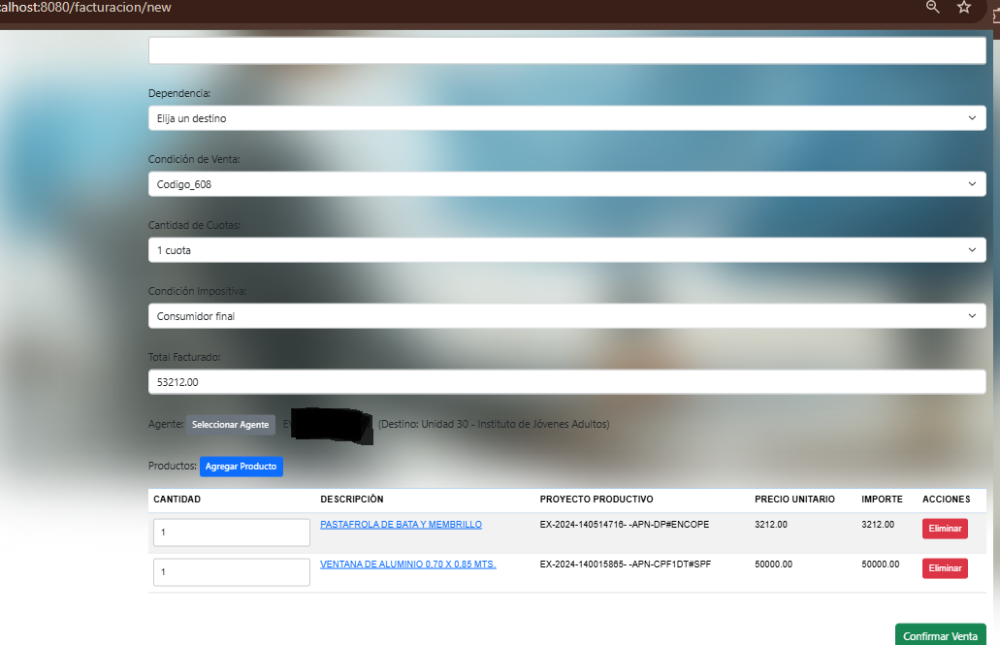
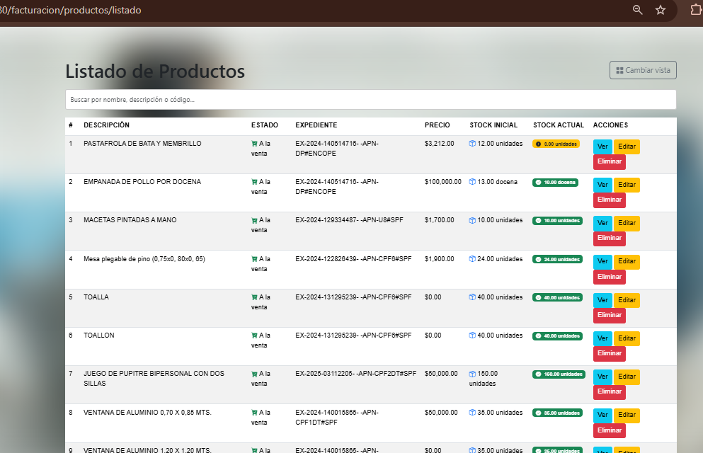
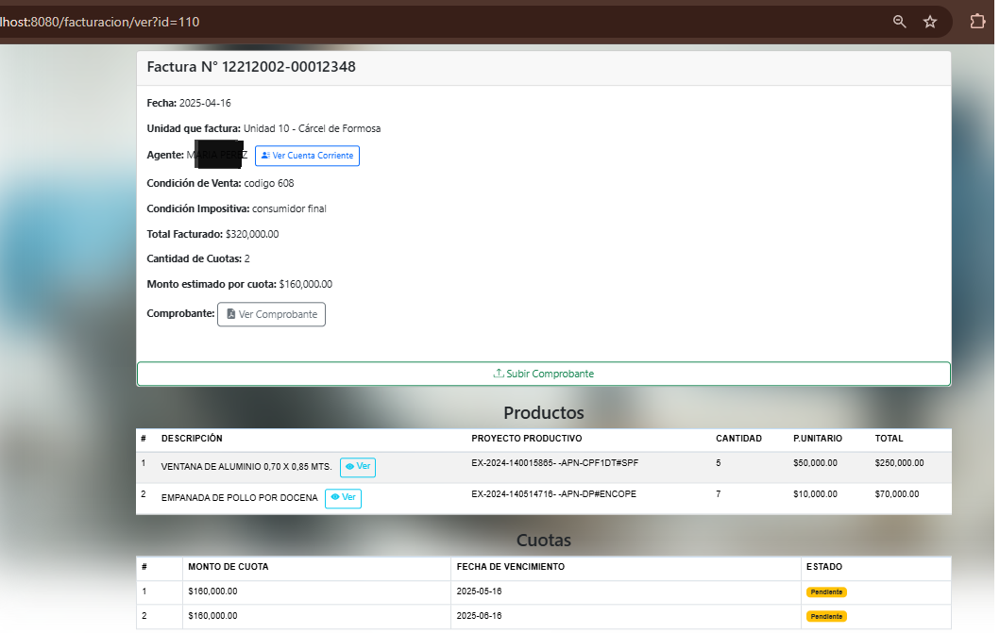
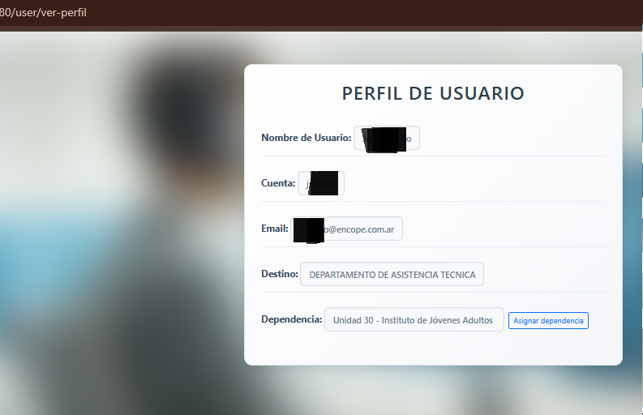
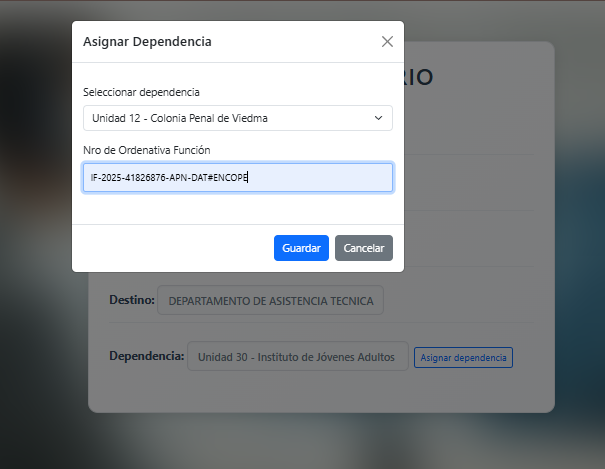

# 📘 Documentación de Vistas del Sistema - Descuento de Haberes para la Dirección de Comercial

Este documento tiene como fin mantener una **documentación viva** de las vistas implementadas en el sistema, con descripciones funcionales, capturas y consideraciones técnicas de cada una.

---

## 🗋 Vista Principal (Dashboard)

**Funcionalidad:** Muestra distintas métricas generales del sistema. En esta vista se destacan:

- Facturas con y sin comprobantes
- Productos con y sin precio
- Productos por unidad de medida

> Esta vista podrá extenderse para incluir gráficos de seguimiento de ventas, productos más vendidos, stock crítico, entre otros indicadores clave.

**Captura:**

---

## 📅 Vista de Ventas Realizadas

**Funcionalidad:** Permite visualizar todas las facturas registradas, incluyendo:

- Cuotas generadas
- Condición de venta
- Fecha de confección
- Estado de comprobante (subido o pendiente)

**Captura:**

---

## 📝 Vista de Nueva Factura

**Funcionalidad:** Permite confeccionar un nuevo comprobante de venta. Se pueden seleccionar:

- Agente (con datos actualizados)
- Productos (solo aquellos con stock y precio vigente)

Se controla que:

- No puedan seleccionarse productos sin stock o precio
- El total se calcule dinámicamente
- Las cuotas respeten un mínimo de $10.000 por cuota

**Captura:**

---

## 🏢 Vista de Productos

**Funcionalidad:** Muestra el listado de productos disponibles. Incluye:

- Stock inicial y stock actual
- Estado del producto (a la venta, sin stock, decomisado)
- Posibilidad de editar precio o informar decomiso

El stock se actualiza automáticamente con cada venta.

**Captura:**

---

## 📊 Vista Detalle de Producto

**Funcionalidad:** Vista extendida con información detallada de un producto. Permite:

- Ver stock actual
- Informar decomisos
- Agregar nuevo precio
- Ver historial de inventario (ingresos, egresos por venta o decomisos)

**Captura:**

---

## 📄 Vista Detalle de Factura

**Funcionalidad:** Muestra los datos completos del comprobante:

- Agente al que fue facturado
- Comprobante (ver o subir nuevo)
- Productos vinculados
- Cuotas generadas
- Punto de venta desde el cual se emitió

**Captura:**

---

## 👤 Vista Perfil de Usuario

**Funcionalidad:** Muestra los datos del usuario actual. Permite:

- Ver cuenta, nombre, email y destino
- Asignar dependencia (a través de un modal)
- Ingresar número de ordenativa/función

> La asignación de dependencia define a qué punto de venta está asociado el usuario. Al confeccionar una factura, se busca automáticamente el próximo número de factura para ese punto de venta.

**Captura:**

---

## 📑 Vista Requisito para Asignación de Dependencia

**Funcionalidad:** Permite validar el ingreso de una ordenativa/función al asignar una dependencia al usuario logueado. Este registro queda vinculado al punto de venta, que se utiliza luego para determinar el número de factura secuencial.

**Captura:**

---

## 📊 Vista Reporte de Cuotas (Agrupado por Agente)

**Ruta:** `/facturacion/cuotas/listado`

**Funcionalidad:** Agrupa cuotas por agente, permite generar reportes considerando:

- Estado de la cuota (pendiente, reprogramada, pagada)
- Tope de $100.000 mensuales por agente
- Exportación a TXT

**Captura:**

---

## 🧾 Vista Listado de Agentes

**Ruta:** `/facturacion/agentes/listado`

**Funcionalidad:** Vista con paginación, búsqueda dinámica por nombre, apellido, credencial o beneficio. Muestra agentes activos y retirados, con diferenciación visual por estado y tipo de carácter.

**Campos:**
- Credencial o Beneficio (según estado del agente)
- Nombre y Apellido
- CUIL (ícono si no disponible)
- Dependencia (texto o ícono si sin dependencia)
- Estado visual (activo con ícono verde, retirado muestra el carácter con badge)

**Captura:**

---

## 💼 Vista Cuenta Corriente del Agente

**Ruta:** `/facturacion/agente/ver?agente_id=ID`

**Funcionalidad:** Vista de detalle con el saldo actual y los movimientos de cuenta corriente del agente seleccionado. Muestra también información detallada si es un agente retirado (carácter, beneficio, domicilio, etc).

**Componentes:**
- Cabecera con datos del agente y saldo
- Tabla de movimientos con íconos (💰 crédito, 📅 débito)
- Botón para exportar PDF del extracto

**Captura:**

---

> 🛠️ **Notas generales:**
> - Esta documentación se actualizará conforme se sumen nuevas vistas y funcionalidades.
> - Las capturas deben guardarse en `docs/img/` y versionarse junto al repositorio.

---

_Última actualización: 23/04/2025_

