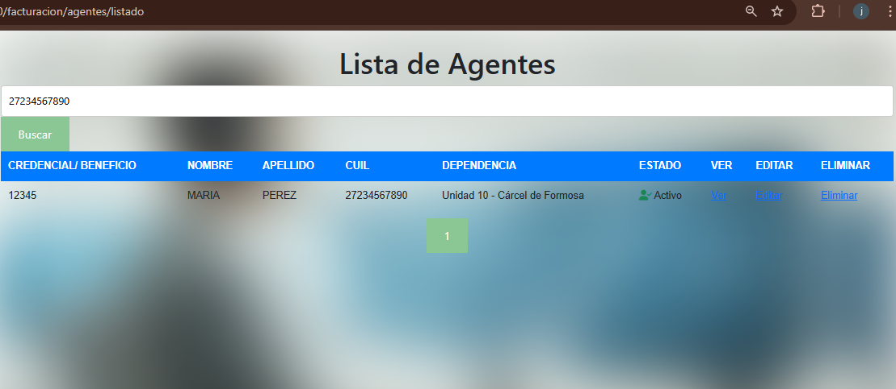
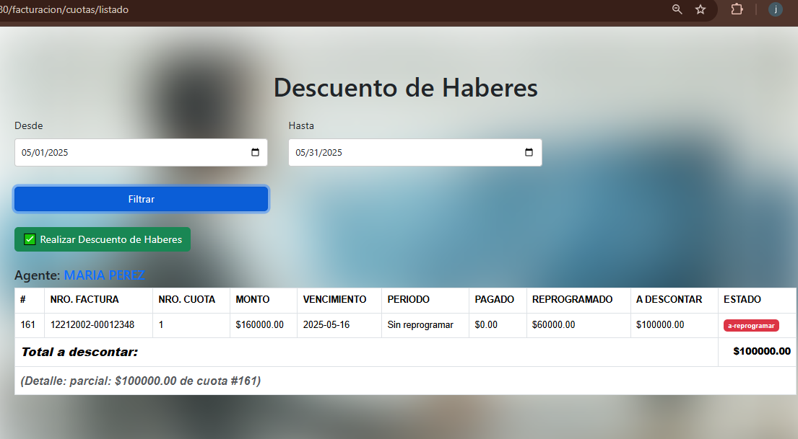

# 📘 Documentación de Vistas del Sistema - Descuento de Haberes para la Direccion de Comercial

Este documento tiene como fin mantener una **documentación viva** de las vistas implementadas en el sistema, con descripciones funcionales, capturas y consideraciones técnicas de cada una.

---

## 📄 Índice

1. [Listado de Agentes](#1-listado-de-agentes)
2. [Cuenta Corriente del Agente](#2-cuenta-corriente-del-agente)
3. [Reportes de Cuotas](#3-reportes-de-cuotas)
4. [Formulario de Nueva Venta](#4-formulario-de-nueva-venta)

---

## 1. 🧾 Listado de Agentes

**Ruta:** `/facturacion/agentes/listado`

**Descripción:** Vista con paginación, búsqueda dinámica por nombre, apellido, credencial o beneficio. Muestra agentes activos y retirados, con diferenciación visual por estado y tipo de carácter.

**Campos:**
- Credencial o Beneficio (según estado del agente)
- Nombre y Apellido
- CUIL (ícono si no disponible)
- Dependencia (texto o ícono si sin dependencia)
- Estado visual (activo con ícono verde, retirado muestra el carácter con badge)

**Captura:**

---

## 2. 💼 Cuenta Corriente del Agente

**Ruta:** `/facturacion/agente/ver?agente_id=ID`

**Descripción:** Vista de detalle con el saldo actual y los movimientos de cuenta corriente del agente seleccionado. Muestra también información detallada si es un agente retirado (carácter, beneficio, domicilio, etc).

**Componentes:**
- Cabecera con datos del agente y saldo
- Tabla de movimientos con íconos (💰 crédito, 📅 débito)
- Botón para exportar PDF del extracto

**Captura:**

---

## 3. 📊 Reportes de Cuotas (Agrupado por Agente)

**Ruta:** `/facturacion/cuotas/listado`

**Descripción:** Vista para generar reportes de descuentos agrupados por agente. Se agrupan cuotas por agente y se determina automáticamente el estado final de las cuotas (pagadas, reprogramadas o pendientes).

**Notas:**
- Se permite exportar a TXT
- Se integra con la lógica de "tope $100.000 mensuales"

---

**Captura:**

## 4. 🧾 Formulario de Nueva Venta

**Ruta:** `/facturacion/new`

**Descripción:** Formulario para registrar una nueva factura/venta. Selección de productos, método de pago y cantidad de cuotas.

**Consideraciones:**
- Validación dinámica
- Cálculo automático de totales y cuotas

---

> 🧩 **Notas generales:**
> - Esta documentación puede extenderse con nuevas vistas.
> - Las capturas deben guardarse en `docs/img/` y versionarse junto al repo.

---

_Última actualización: 16/04/2025_

